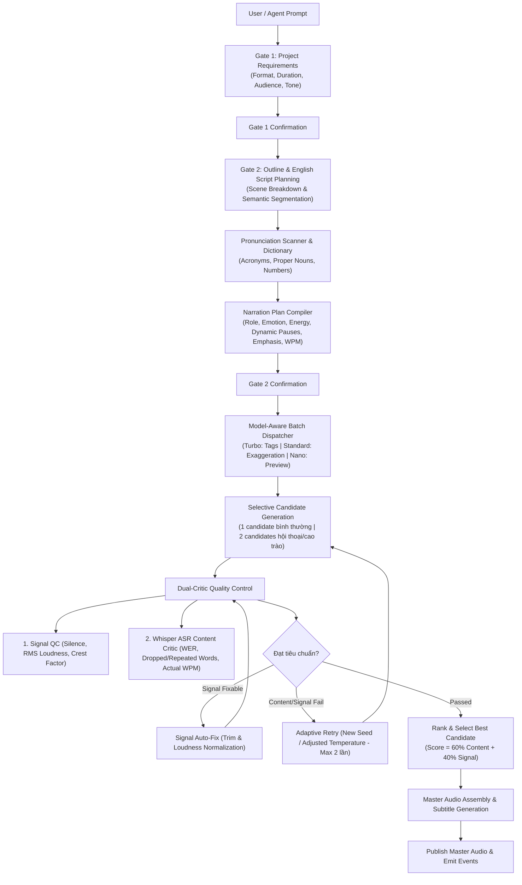

# Chatterbox Storytelling & Voice Production Pipeline

Tài liệu hướng dẫn kiến trúc và chi tiết kỹ thuật cho hệ thống Storytelling & Narration Studio trong Chatterbox.

---

## 1. Tổng quan Kiến Trúc (End-to-End Workflow)



---

## 2. Các Module Chính & Trách Nhiệm (Core Modules)

| Module | File | Trách nhiệm chính |
| :--- | :--- | :--- |
| **Narration Planner** | [`services/narration_planner.py`](file:///var/www/chatterbox/services/narration_planner.py) | Quét từ phát âm khó (`scan_pronunciation_candidates`), áp dụng từ điển (`apply_pronunciation_dict`), phân tích vai trò (`role`), cảm xúc (`emotion`), năng lượng (`energy`), tốc độ (`target_wpm`), khoảng nghỉ (`pause_before_ms`, `pause_after_ms`), nhấn từ (`emphasis`), và cờ candidate (`candidate_strategy`). |
| **Requirements Engine** | [`services/project_requirements.py`](file:///var/www/chatterbox/services/project_requirements.py) | Phân tích heuristic yêu cầu từ văn bản, gán giá trị mặc định chuẩn tiếng Anh, gom câu hỏi làm rõ tập trung (Single-batch questions). |
| **Script Engine** | [`services/project_script.py`](file:///var/www/chatterbox/services/project_script.py) | Sinh kịch bản tiếng Anh theo cấu trúc scene, phân đoạn ngữ nghĩa (8-25s / 1-3 câu), gắn Narration Plan vào từng segment. |
| **State Machine Facade** | [`services/project_planner.py`](file:///var/www/chatterbox/services/project_planner.py) | Quản lý vòng đời dự án (Gate 1, Gate 2), lưu trữ metadata trên đĩa (`tmp/api/projects/`), đồng bộ tiến độ với JobManager, dispatch batch render. |
| **Signal QC & Auto-Fix** | [`services/audio.py`](file:///var/www/chatterbox/services/audio.py) | Đo RMS loudness (-24dB đến -12dB), clipping (<= 0.98), khoảng lặng đầu/cuối, crest factor, tự động cắt khoảng lặng thừa và chuẩn hóa âm lượng. |
| **ASR Content Critic** | [`services/critic.py`](file:///var/www/chatterbox/services/critic.py) | Sử dụng Whisper STT để nhận diện giọng đọc từ audio đã sinh, tính WER, phát hiện thiếu chữ/nuốt từ (`missing_words`), phát hiện nói lắp/lặp từ ảo giác (`repeated_words`), đo WPM thực tế. |
| **Batch Runner** | [`services/batch_runner.py`](file:///var/www/chatterbox/services/batch_runner.py) | Điều phối sinh âm thanh đa đoạn, sinh 2-candidate cho đoạn phức tạp, xếp hạng candidate, retry thông minh tối đa 2 lần, ghép nối âm thanh hoàn chỉnh. |
| **Subprocess Runner** | [`inference_runner.py`](file:///var/www/chatterbox/inference_runner.py) | Đồng bộ 100% logic với Batch Runner khi thực thi trong tiến trình subprocess độc lập. |
| **MCP Adapter** | [`mcp_adapter/`](file:///var/www/chatterbox/mcp_adapter/) | Bộ chuyển đổi chuẩn MCP JSON-RPC stdio cho Antigravity / Codex AI. |

---

## 3. Cấu Trúc Dữ Liệu Narration Plan (Schema)

Mỗi phân đoạn trong `project["segments"]` hoặc `lines_results` chứa đối tượng `narration_plan`:

```json
{
  "role": "narrator",                  // "narrator" | "dialogue" | "monologue"
  "emotion": "suspense",               // "engaging" | "suspense" | "thoughtful" | "energetic" | "dramatic" | "calm"
  "energy": 0.35,                      // 0.20 - 0.85 (dùng cho pacing & loudness target)
  "pace": "slow",                      // "slow" (110 WPM) | "medium" (138 WPM) | "fast" (165 WPM)
  "target_wpm": 112,                   // Tốc độ từ trên phút mong muốn
  "pause_before_ms": 100,              // Khoảng nghỉ trước dòng (dialogue: 250ms, narrator: 100ms)
  "pause_after_ms": 700,               // Khoảng nghỉ kết thúc câu (dấu chấm/hỏi/than: 700ms, dấu phẩy: 400ms)
  "emphasis": ["slowly", "shadow"],    // Danh sách từ khóa cần nhấn giọng
  "pronunciation": {                   // Ghi đè phiên âm từ vựng áp dụng riêng cho đoạn này
    "NASA": "N.A.S.A."
  },
  "model": "turbo",                    // Model phân bổ: "turbo", "standard", "nano"
  "candidate_strategy": "multi_selective" // "single" hoặc "multi_selective"
}
```

---

## 4. Quy Tắc Model & Tham Số (Model-Aware Parameter Invariants)

1. **Chatterbox Turbo (`tts_turbo.py`)**:
   - Tối ưu cho diễn cảm, narration và dialogue sáng tạo.
   - Hỗ trợ các thẻ cảm xúc paralinguistic tags: `[laugh]`, `[sigh]`, `[chuckle]`, `[whisper]`, `[gasp]`, `[cough]`, `[yawn]`, `[snicker]`, `[throat-clearing]`.
   - **LƯU Ý QUAN TRỌNG**: Turbo **bỏ qua** các tham số `cfg_weight`, `exaggeration` và `min_p`. Backend tự động loại bỏ các tham số này trước khi gọi inference Turbo để tránh gây nhầm lẫn.
2. **Chatterbox Standard (`tts.py`)**:
   - Phù hợp cho các phân đoạn cao trào, kịch tính cần điều khiển cường độ diễn cảm chính xác.
   - Hỗ trợ điều chỉnh `exaggeration` (tăng độ kịch tính) và `cfg_weight` (hạ nhẹ để tăng độ tự nhiên khi kịch tính).
3. **Chatterbox Nano**:
   - Model siêu nhẹ (110M), tối ưu cho CPU và preview nhanh cấu trúc kịch bản.
4. **Bộ nhớ RAM (Single Model in Memory)**:
   - Hệ thống chỉ duy trì **1 mô hình duy nhất** trong VRAM/RAM tại một thời điểm, giải phóng cache trước khi chuyển đổi mô hình.

---

## 5. Quy Trình Kiểm Tra Kép (Dual-Critic Quality Control)

### Bước 1: Signal QC (`services/audio.py`)
- **RMS Loudness**: Đạt trong khoảng `[-24.0, -12.0]` dB (lý tưởng: `-18.0` dB).
- **Peak Clipping**: Không vượt quá `0.98` (-0.2 dBFS).
- **Leading / Trailing Silence**: Khoảng lặng đầu/cuối không vượt quá `0.25s`.
- **Crest Factor**: Kiểm tra tỉ lệ peak/RMS để tránh audio bị nén bẹt hoặc chỉ có tiếng nổ đột ngột.
- **Tự động sửa lỗi (Auto-Fix)**: Nếu có lỗi fixable (ví dụ: khoảng lặng quá dài hoặc âm lượng lệch), chạy cắt khoảng lặng thừa và chuẩn hóa âm lượng theo chuẩn broadcast.

### Bước 2: ASR Speech Content Critic (`services/critic.py`)
- **Transcription**: Dùng Whisper Tiny để nhận diện transcript từ waveform đã sinh.
- **Word Error Rate (WER)**: So sánh từ vựng giữa kịch bản gốc và STT.
- **Missing Words (Dropped Text)**: Nếu tỷ lệ từ bị đọc thiếu `> 35%` $\rightarrow$ **Hard Fail** để kích hoạt retry.
- **Repeated Words (Hallucination / Stutter)**: Nếu phát hiện lặp lại từ liên tiếp do model bị kẹt token $\rightarrow$ **Hard Fail**.
- **WPM Deviation**: Cảnh báo nếu tốc độ đọc lệch quá 55 WPM so với `target_wpm`.

### Bước 3: Đánh Giá & Xếp Hạng Candidate
- Điểm tổng hợp: $\text{Score} = \text{Content Score} \times 0.6 + \text{Signal Score} \times 0.4$.
- Chọn candidate có điểm cao nhất và `passed == True`.
- Nếu thất bại sau 2 lần retry thích ứng (đổi seed, hạ temperature), đánh dấu segment `failed` $\rightarrow$ Job chuyển trạng thái `completed_partial`.

---

## 6. Danh Mục Công Cụ MCP (16 Tools)

Antigravity / Codex AI điều phối toàn bộ workflow qua các công cụ MCP:

1. `chatterbox_list_characters`: Lấy danh sách giọng nhân vật.
2. `chatterbox_generate_tts`: Sinh âm thanh đơn lẻ.
3. `chatterbox_get_job_status`: Kiểm tra tiến độ và benchmark của tác vụ.
4. `chatterbox_download_audio`: Tải file âm thanh về máy local an toàn (chống path traversal).
5. `chatterbox_convert_voice`: Chuyển đổi giọng nói (Voice Conversion).
6. `chatterbox_evaluate_voice`: Đánh giá tín hiệu và ngữ điệu audio qua Voice Critic.
7. `chatterbox_prepare_project`: Khởi tạo dự án âm thanh mới, trích xuất yêu cầu và nhận danh sách câu hỏi làm rõ.
8. `chatterbox_answer_project_questions`: Gửi câu trả lời cho các câu hỏi còn thiếu.
9. `chatterbox_confirm_requirements`: **Gate 1** — Xác nhận yêu cầu để chuyển sang bước soạn kịch bản.
10. `chatterbox_generate_script`: Sinh hoặc cập nhật kịch bản tiếng Anh và cấu trúc scene.
11. `chatterbox_confirm_script`: **Gate 2** — Xác nhận kịch bản, nạp từ điển phát âm (`pronunciation_dict`) và phê duyệt dự án.
12. `chatterbox_confirm_project`: Dispatcher xác nhận gate đang chờ hiện tại.
13. `chatterbox_render_project`: Thực thi render toàn bộ dự án thành Master Audio qua batch processing.
14. `chatterbox_get_project`: Lấy toàn bộ thông tin chi tiết, kịch bản, phân đoạn và file xuất bản của dự án.
15. `chatterbox_list_projects`: Liệt kê tất cả các dự án âm thanh.
16. `chatterbox_get_events_stream`: Lấy luồng sự kiện theo thời gian thực (Event Bus Stream).

---

## 7. Kiểm Thử Hệ Thống (Testing Commands)

```bash
# Chạy focused test bộ Storytelling & Narration
./venv/bin/python -m unittest -v tests/test_narration_plan.py tests/test_audio_quality.py tests/test_project_workflow.py

# Chạy toàn bộ test suite dự án
./run_chatterbox_api.sh --test
```
